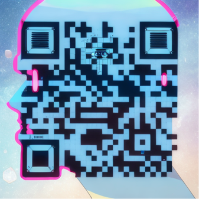

# AI-Powered Content Editor

A modern, feature-rich content editing platform enhanced with Mistral AI capabilities. Built with Next.js and a comprehensive UI component system.



## ✨ Features

- **Rich Text Editing**: Powered by Tiptap with support for tables, text styling, and more
- **AI Assistance**: Integrated with Mistral AI for intelligent content suggestions
- **Modern UI**: Built with Radix UI primitives and styled with Tailwind CSS
- **Responsive Design**: Works seamlessly across desktop and mobile devices
- **Theme Support**: Light and dark mode with next-themes
- **Form Handling**: Robust form management with react-hook-form and zod validation

## 🚀 Getting Started

### Prerequisites

- Node.js 18.x or higher
- npm or yarn or pnpm (feel free to use bun or corepack)

### Installation

**Clone the repository**
```bash
git clone https://github.com/blue-lotus-org/mistral-content-editor.git
cd ai-content-editor
```

**Install dependencies**
```bash
npm install
# or
yarn install
```

**Start the development server**
```bash
npm run dev
# or
yarn dev
# or
pnpm dev
```

> **Note**: if use pnpm, then run: `pnpm approve-builds` and install sharp script.
> **Note Tiptap Error**: SSR has been detected, please set `immediatelyRender` explicitly to `false` to avoid hydration mismatches.

Open http://localhost:3000 in your browser

---

🛠️ **Built With**
- Next.js - React framework
- Tiptap - Headless editor framework
- Radix UI - Unstyled, accessible UI components
- Tailwind CSS - Utility-first CSS framework
- Mistral AI - AI language model integration
- React Hook Form - Form state management
- Zod - TypeScript-first schema validation

📖 **Usage**\
The editor provides an intuitive interface for creating and editing content with AI assistance:

- First, you need to create an account on Mistral AI and get your API key and paste it in the "gear ⚙️" icon on the top right corner. This is store/restore from you/user's local storage.
- Use the formatting toolbar to style your text
- Access AI suggestions by selecting text and using the AI context menu
- Create tables, lists, and other complex content structures
- Toggle between light and dark themes

🤝 **Contributing**\
Contributions are welcome! Please feel free to submit a Pull Request.

- Fork the repository
- Create your feature branch (git checkout -b feature/amazing-feature)
- Commit your changes (git commit -m 'Add some amazing feature')
- Push to the branch (git push origin feature/amazing-feature)
- Open a Pull Request

📄 **License**\
This project is licensed under the MIT/Apache2 Licenses - see the LICENSE file for details.

🙏 **Acknowledgments**
- Shadcn UI - For inspiration on component design
- The Mistral AI team for their powerful language model
- All open-source contributors whose libraries made this project possible

**Credits**
- UI: v0.dev
- AI: Mistral AI
- [BLUE LOTUS](https://lotuschain.org)
